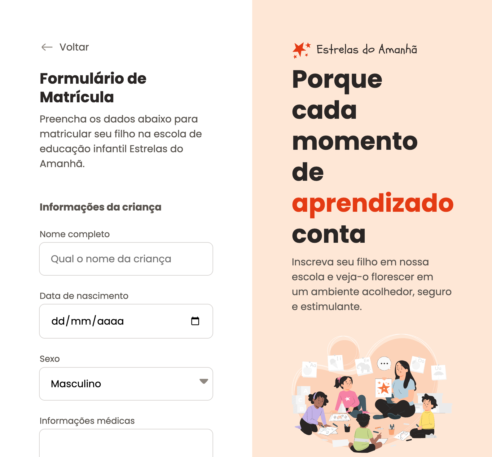

<div align="center">

# 📋 School Enrollment Form

A modern and responsive school enrollment form designed for a fictional early childhood education institution.

This project was developed during the **Full-Stack Development** program by **Rocketseat**, focusing on building complex forms with semantic HTML, responsive layouts, reusable CSS, and an intuitive user experience.

<p>


</p>

</div>

---

# 📸 Preview

<p align="center">

</p>

> Save the project screenshot as **preview.png** inside the **assets** folder.

---

# ✨ Features

- 📋 Complete enrollment form
- 👶 Child information section
- 👨‍👩‍👧 Parent or guardian information
- 📅 Date picker
- 📂 File upload field
- 🔘 Radio buttons and checkboxes
- 📑 Select dropdowns
- 📝 Text areas
- 📱 Responsive two-column layout
- 🎨 Clean and accessible interface

---

# 🛠️ Technologies

- HTML5
- CSS3
- Flexbox
- CSS Grid

---

# 🎯 Project Goals

The goal of this project was to improve my Front-End development skills by creating a realistic enrollment form with multiple input types and a well-structured layout.

Throughout this project, I practiced:

- Semantic HTML
- Form creation
- Form accessibility
- CSS Grid
- Flexbox
- Responsive Design
- Input styling
- Layout organization
- Component structure
- Visual consistency

---

# 📂 Project Structure

```text
📦 formulario-de-matricula
├── assets/
│   ├── preview.png
│   ├── icons/
│   ├── images/
│   └── logo.svg
├── index.html
├── style.css
└── README.md
```

---

# 🚀 Getting Started

Clone this repository:

```bash
git clone https://github.com/mussatograziela/formulario-de-matricula.git
```

Navigate to the project folder:

```bash
cd formulario-de-matricula
```

Open **index.html** in your preferred browser or run it using the **Live Server** extension in Visual Studio Code.

---

# 📚 What I Learned

This project helped me strengthen my knowledge of:

- Semantic HTML5
- Complex form structures
- Form accessibility
- CSS Grid
- Flexbox
- Responsive layouts
- Input customization
- Component organization
- Clean and maintainable CSS

---

# 💡 Challenges

This was one of the most challenging projects I've worked on during my studies.

Some of the main challenges included:

- Organizing a large form into meaningful sections.
- Styling multiple input types while keeping a consistent design.
- Building a responsive two-column layout.
- Managing spacing and alignment across different screen sizes.
- Creating reusable CSS classes to keep the stylesheet clean and organized.

---

# 🔮 Future Improvements

- [ ] Add form validation using JavaScript.
- [ ] Display success and error messages.
- [ ] Save submitted data.
- [ ] Improve accessibility following WCAG guidelines.
- [ ] Add Dark Mode.
- [ ] Integrate the form with a backend service.

---

# 👩‍💻 Author

<div align="center">

## **Graziela Jordana Mussato**

**Front-End Developer**

Passionate about building modern, responsive, and accessible web interfaces while continuously improving my Front-End development skills.

<p>

<a href="https://github.com/mussatograziela">

</a>

<a href="https://www.linkedin.com/in/graziela-mussato">

</a>

</p>

</div>

---

<div align="center">

⭐ If you found this project interesting, consider giving it a star!

</div>
